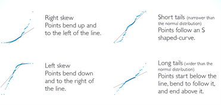

```{r setup, include=FALSE}
rm(list = ls())

knitr::opts_chunk$set(echo = TRUE,
                      fig.align="center")
```

# Kennzahlen

## Umfang

$n$ = Stichprobenumfang   
$N$ = Umfang der Population  

## Arithmetisches Mittel, Mittelwert

$\bar{x}$ = Stichprobenmittelwert  
$\mu$ = Populationsmittelwert

$$\bar{x} = \sum_{i=1}^n \frac{x_i}{n}$$
```{r mean, eval=FALSE}
mean()
```

Beispiel:

```{r mean-expl}
x <- c(2, 3, 4, 4, 5, 6)
mean(x)
```
## Median

wenn $n$ ungerade

$$\tilde{x} = x_{\frac{n+1}{2}}$$

wenn $n$ gerade  

$$\tilde{x} = \frac{1}{2}(x_{\frac{n}{2}} + {x_{\frac{n}{2}+1}})$$

```{r median, eval = FALSE}
median()
```

Beispiel:

```{r median-expl}
x <- c(2, 3, 4, 4, 5, 6, 10)
median(x)
```

Varianz

$s^2$ = Stichprobenvarianz  
$\sigma^2$ = Varianz der Population

$$s^2 = \frac{\sum_{i=1}^n (x_i - \bar{x})^2}{n-1}$$

$$\sigma^2 = \frac{\sum_{i=1}^n (x_i - \mu)^2}{n}$$

```{r var, eval=FALSE}
var()
```

Beispiel:

```{r var-expl}
x <- c(2, 3, 4, 4, 5, 6, 10)
var(x)
```


## Standardabweichung  

$s$ = Standardabweichung der Stichprobe  
$\sigma$ = Standardabweichung der Population  

$$s = \sqrt{s^2}$$

$$\sigma = \sqrt{\sigma^2}$$

```{r sd, eval=FALSE}
sd()
```

Beispiel:

```{r}
x <- c(2, 3, 4, 4, 5, 6, 10)
sd(x)
```

# Grafiken

## Histogramm

```{r hist, eval=FALSE}
hist()
```

Beispiel:

```{r hist-expl}
x <- c(2, 3, 4, 4, 5, 6, 10, 9, 8, 7, 7, 7, 5, 4)
hist(x)
```

## Boxplot

```{r boxplot, eval=FALSE}
boxplot()
```

Beispiel:

```{r boxplot-expl}
x <- c(2, 3, 4, 4, 5, 6, 10, 9, 8, 7, 7, 7, 5, 4)
boxplot(x)
```

## Kreuztabelle, absolute Häufigkeiten

```{r table, eval=FALSE}
table()
```

Beispiel:

```{r}
x <- c("a", "a", "b", "b", "b", "c")
table(x)
```

## Kreuztabelle, relative Häufigkeiten

```{r prop.table, eval=FALSE}
prop.table()
```

Beispiel:

```{r}
x = c("a", "a", "b", "b", "b", "c")
prop.table(table(x))
```

## Balkendiagramm

```{r barplot, eval = FALSE}
barplot()
```

Beispiel:

```{r barplot-expl}
x = c("a", "a", "b", "b", "b", "c")
barplot(table(x))
```

# Normalverteilung

$$X \sim N(\mu, \sigma)$$

## 68-95-99.7-Regel

* 68% in $\mu \pm 1\sigma$   
* 95% in $\mu \pm 2\sigma$, genauer $\mu \pm 1.96\sigma$  
* 99.7% in $\mu \pm 3\sigma$  

## z-Wert

$$z = \frac{x_i-\bar{x}}{s}$$

* Der z-Wert einer Beobachtung $x_i$ gibt an, um wieviele Standardabweichungen die Beobachtung über oder unter dem Mittelwert liegt.   
* Der z-Wert des Mittelwerts ist 0  
* Ungewöhnliche Beobachtungen haben einen z-Wert von $|z|>2$.  

## Perzentilen in R berechnen   

```{r percentiles, eval=FALSE}
# Fläche links von x
pnorm(x, mean, sd)  

# Fläche rechts von x
1 - pnorm(x, mean, sd)
pnorm(x, mean, sd, lower.tail = FALSE) 

# Wert auf einer bestimmten Perzentile
qnorm(percentile, mean, sd) 
```

Beispiel:

```{r perc-expl, eval=TRUE}
x <- c(2, 3, 4, 4, 5, 6, 10, 9, 8, 7, 7, 7, 5, 4)
mittelwert <- mean(x)
stdabw <- sd(x)

# Wahrscheinlichkeit für den Wert kleiner oder gleich 7
pnorm(7, mittelwert, stdabw)

# Wahrscheinlichkeit für den Wert gleich oder grösser 7
1 - pnorm(7, mittelwert, stdabw)

# Wert auf der 40%-Perzentile
qnorm(.4, mittelwert, stdabw)
```

## QQ-Plot

```{r qq, eval=FALSE}
# Punkte in Streudiagramm darstellen
qqnorm()

# Linie in QQ-Plot einzeichnen
qqline()
```

Beispiel:

```{r}
# simulation von 100 normalverteilten Werten, mean = 0, s = 1
set.seed(1)
x <- rnorm(100)

## qq-plot erstellen
qqnorm(x)

## Linie in qq-plot einzeichnen
qqline(x, col = "blue")
```

<center>

</center>

# Grundlagen der Inferenzstatstik

## Zentraler Grenzwertsatz

Die Verteilung von Stichprobenkennzahlen (z.B. Mittelwert) folgt annähernd einer Normalverteilung. Ihr Mittelwert liegt in der Nähe des Populationsmittelwertes $\mu$ mit einer Standardabweichung geteilt durch die Quadratwurzel des Stichprobenumfangs.

$$\bar{x} \sim N(Mittelwert = \mu, SE = \frac{\sigma}{\sqrt{n}})$$

Wenn $\sigma$ unbekannt ist (was eigentlich immer der Fall ist), wird die Standardabweichung $s$ der Stichprobe als Schätzer für $\sigma$ eingesetzt.

$$SE = \frac{s}{\sqrt{n}}$$

Bedingungen für die Gültigkeit des zentralen Grenzwertsatzes:  

* Die Beobachtungseinheiten in der Stichprobe sind unabhängig voneinander (zufällige Auswahl, zufällige Zuordnung zu Gruppen).   
* Faustregel: Stichprobenumfang $n>30$

Beispiel für die Berechnung des Standardfehlers $SE$ in `R`

```{r}
# simulation von 100 normalverteilten Werten, mean = 0, s = 1
set.seed(1234)
x <- rnorm(100)

# Stichprobenumfang von x ermitteln
n <- length(x)

# Standardabweichung von x berechnen
s <- sd(x)

# Berechnung von SE
SE <- s/sqrt(n)

# Output SE
SE
```

## Konfidenzintervalle  

Konfidenzintervalle (Vertrauensintervalle, $CI$) können auf jedem Konfidenzniveau berechnet werden. Um die Sache nicht allzu kompliziert zu machen, wird hier v.a. exemplarisch die Berechnung von 95%-Konfidenzinteravallen vorgestellt.  

* Signifikanzniveau = $\alpha$ 
* Konfidenzniveau = $1-\alpha$  

$$CI^* = \bar{x} \pm z^* \times SE$$

$$z^* = \vert \frac{(1-CI^*)}{2} \vert$$

$$z^* \times SE = z^* \times \frac{s}{\sqrt{n}}$$

$z^* \times SE$ wird auch als Fehlerbereich (engl. $margin~ of~ error,~ ME$) bezeichnet.

Der Wert von $z^*$ ist abhängig vom Konfidenzniveau.   

```{r z-values}
# z für ein 95% CI
CI <- .95
z95 <- abs(qnorm((1 - CI)/2))
z95

# z für ein 90% CI
CI <- .9
z90 <- abs(qnorm((1 - CI)/2))
z90

# z für ein 99% CI
CI <- .99
z99 <- abs(qnorm((1 - CI)/2))
z99
```

Beispiel für die Berechnung eines 95% Konfidenzintervalls

```{r}
m <- 95.6       # Stichprobenmittelwert
s <- 15.8       # Standardabweichung der Stichprobe
n <- 100        # Stichprobenumfang

# gesucht ist das 95% Konfidenzintervall für den Populationsmittelwert  
CI <- .95       # Konfidenzniveau 95%
z <- abs(qnorm((1-CI)/2))
ME <- z * CI    # Fehlerbereich berechnen

# Obere und untere Grenze für 95%-Konfidenzintervall berechnen
CI95 <- m + c(-1, 1) * ME
CI95
```

## Zuverlässigkeit vs. Präzision  

Wenn wir das Konfidenzniveau erhöhen (Konfidenzintervall wird breiter, z.B. von 95% auf 99%) nimmt die Zuverlässigkeit, dass wir den wahren Populationsparameter im Intervall haben zu, allerdings auf Kosten der Präzision.   
Wie können wir Zuverlässigkeit und Präzision gleichzeitig verbessern? Antwort: Stichprobenumfang erhöhen.   

Stichprobenumfang für einen bestimmten Fehlerbereich berechnen:

$$ME = z^* \times \frac{s}{\sqrt{n}} \rightarrow n = (\frac{z^* \times s}{ME})^2$$

Beispiel: Im Beispiel oben betrug unser ME = 1.862. Wir möchten den ME halbieren und bestimmen den benötigten Stichprobenumfang. (Kennzahlen wie oben)

```{r}
ME.alt <- 1.862
ME.neu <- ME.alt/2

# neues 95%-Konfidenzintervall berechnen
CI95.neu <- m + c(-1, 1) * ME.neu
CI95.neu

# Stichprobenumfang für das neue 95%-CI berechnen
n.neu <- ((z * s)/ME.neu)^2
n.neu
```

## Hypothesentest für einen Mittelwert   

**Hypothesentests werden immer für einen Popultionsparameter, z.B. $\mu$ durchgeführt und nicht für eine Stichprobe.**

1. Formuliere die wissenschaftliche Hypothese  

  * $H_0: \mu = Nullwert$   
  * $H_A: \mu < oder > oder \neq Nullwert$  
  * Es wird empfohlen $H_A:$ immer zweiseitig formulieren ausser in begründeten Ausnahmefällen.
  
2. Berechne den Punktschätzer $\bar{x}$ für $\mu$  
3. Überprüfe die Testvoraussetzungen   

  * Beobachtungseinheiten in der Stichprobe sind unabhängig.   
  * Stichprobe stammt aus eine annähernd normalverteilten Population.   
  * Der Stichprobenumfang $n \geq 30$ oder grösser bei stark schiefer Verteilung.   
  
4. Skizziere die Stichprobenverteilung, zeichne deinen Verwerfungsbereich ein und berechne die Teststatistik.    

$$z = \frac{\bar{x} - \mu}{SE}, ~~ SE = \frac{s}{\sqrt{n}}$$

5. Liegt $z$ im Verwerfungsbereich wird $H_0$ zu Gunsten von $H_A$ zurückgewiesen.   
6. Interpretiere dein Resultat im Zusammenhang mit der Fragestellung.  

  
### p-Werte berechnen   

Definition: 

$$p-Wert = P(beobachtete~oder~extremere~Teststatistik~ | ~H_0~ wahr)$$

Der p-Wert quantifiziert die Evidenz gegen $H_0$. Ein kleiner $p$-Wert (üblicherweise $p \leq 0.05$) bedeutet, dass du ausreichend Evidenz dafür hast, $H_0$ zu Gunsten von $H_A$ zu verwerfen.   

**Einseitiger Hypothesentest anhand von p-Werten**

1. Fall

$H_A: \mu > Nullwert$

$$z = \frac{\bar{x}-Nullwert}{SE_{\bar{x}}}$$

$p$-Wert in `R` berechnen:

```{r p-value-g, eval=FALSE}
p <- 1 - pnorm(z)
```

2. Fall

$H_A: \mu < Nullwert$

$$z = \frac{\bar{x}-Nullwert}{SE_{\bar{x}}}$$

$p$-Wert in `R` berechnen:

```{r p-value-l, eval=FALSE}
p <- pnorm(z)
```


**Zweiseitiger Hypothesentest anhand von p-Werten**

Zweiseitige Hypothesen sind der Normalfall. Einseitige Hypothesen sollten nur in begründeten Ausnahmefällen formuliert werden.  

$H_A: \mu \neq Nullvalue$   

$$z = \frac{\bar{x}-Nullwert}{SE_{\bar{x}}}$$

$p$-Wert in `R` berechnen:

```{r p-value-twos, eval=FALSE}
p <- 2 * pnorm(abs(z), lower.tail = FALSE)

# Alternative
p <- 2 * pnorm(-abs(z))
```

### Entscheidungsfehler

* Fehler 1. Art: $H_0$ wird verworfen wenn $H_0$ wahr ist.   
* Fehler 2. Art: $H_0$ wird nicht verworfen wenn $H_A$ wahr ist.   

Bei einem Signifikanzniveau $\alpha = 0.05$ nehmen wir ein Risiko von 5% in Kauf, einen Fehler 1. Art zu begehen. 

* $\alpha:$ Wahrscheinlichkeit, einen Fehler 1. Art zu begehen.  
* $\beta:$ Wahrscheinlichkeit, einen Fehler 2. Art zu begehen.   
* $1-\beta:$ Power (Trennschärfe) eines Tests; Wahrscheinlichkeit, für $H_A$ zu entscheiden, wenn $H_A$ wahr ist.

### Hypothesentests mit Konfidenzintervallen  

* Ein zweiseitiger Hypothesentest mit einem Signifikanzniveau $\alpha$ entspricht einem Konfidenzintervall mit dem Konfidenzniveau $1-\alpha$.  
* Ein einseitiger Hypothesentest mit einem Signifikanzniveau $\alpha$ entspricht einem Vertrauensintervall mit einem Konfidenzniveau von $1-(2 \times \alpha)$.   
* Enthält ein 95% Vertrauensintervall den Nullwert nicht, wird $H_0$ verworfen.  
* Enthält ein 95% Vertrauensintervall den Nullwert, wird $H_0$ nicht verworfen.   

# Inferenz für quantitative Daten  

## Hypothesentests für gepaarte Mittelwerte   

* Gepaarte (auch verbundene) Daten:    

  * Gleiche Beobachtungseinheiten: Vorher-Nachher-Messungen, Messwiederholungen  
  * Unterschiedlieche Beobachtungseinheiten (jedoch abhängig): Zwillingsstudien, Partner   

* Parameter: $\mu_{\Delta}$ = Mittelwert der paarweisen Differenzen in der Population      
* Punktschätzer: $\bar{x}_{\Delta}$ = Mittelwert der paarweisen Differenzen in der Stichprobe   
* Teststatistik: $z$-Wert
* Hypothesen:   

  * $H_0: \mu_{\Delta} = Nullwert$   
  * $H_A: \mu_{\Delta} \neq Nullwert$ (zweiseitige $H_A$)  
  
### Vorgehen

1. Wissenschaftliche Hypothesen formulieren   
2. Punktschätzer berechnen   
3. Annahmen prüfen   
  
  * Unabhängigkeit der Beobachtungseinheiten  
  * Paarweise Differenzen sind annähernd normalverteilt.   
  * Stichprobenumfang $n \geq 12$ oder grösser bei stark schiefen Verteilungen  
4. Stichprobenverteilung skizzieren, Verwerfungsbereich einzeichnen und Teststatistik berechnen     
  
  $$z = \frac{\bar{x}_{\Delta} - \mu_{\Delta}}{SE_{\bar{x}_{\Delta}}}$$

5. Liegt $z$ im Verwerfungsbereich wird $H_0$ zu Gunsten von $H_A$ zurückgewiesen.  
6. Resultat im Zusammenhang mit der Fragestellung interpretieren.  

### Konfidenzintervall für gepaarte Daten    

$$CI^* = \bar{x}_{\Delta} \pm z* \times SE_{\Delta}$$
  
  $$CI^* = \bar{x}_{\Delta} \pm z^* \times \frac{s_{\Delta}}{n}$$

## Hypothesentest für unabhängige Mittelwerte   

* unabhängige Daten:   

  * Unterschiedliche Beobachtungseinheiten, z.B. Vergleich von zwei Gruppen
  
* Parameter: $\mu_1 - \mu_2$, z.B. Differenz der Mittelwerte von zwei Populationen  
* Punktschätzer: $\bar{x}_1 - \bar{x}_2$ z.B. Differenz der Mittelwerte von zwei Stichproben    
* Teststatistik: $z$-Wert
* Hypothesen:   

  * $H_0: \mu_1 = \mu_2$ bzw. $H_0: \mu_1 - \mu_2 = 0$   
  * $H_A: \mu_1 \neq \mu_2$ bzw. $H_A: \mu_1 - \mu_2 \neq 0$ (zweiseitige $H_A$) 
  
### Vorgehen   

1. Wissenschaftliche Hypothese formulieren     
2. Punktschätzer berechnen    
3. Annahmen prüfen   
  
  * Unabhängigkeit der Beobachtungseinheiten innerhalb und zwischen den Gruppen   
  * Stichprobe stammt aus eine annähernd normalverteilten Population.   
  * Stichprobenumfang $n_1 \geq 30$ und $n_2 \geq 30$ oder grösser bei stark schiefen Verteilungen   
  
4. Stichprobenverteilung skizzieren, Verwerfungsbereich einzeichnen und Teststatistik berechnen    

$$z = \frac{(\bar{x}_1 - \bar{x}_2)-(\mu_1 - \mu_2)}{SE_{\bar{x}_1 - \bar{x}_2}}$$

$$SE_{\bar{x}_1 - \bar{x}_2} = \sqrt{\frac{s_1^2}{n_1}+\frac{s_2^2}{n_2}}$$

5. Liegt $z$ im Verwerfungsbereich wird $H_0$ zu Gunsten von $H_A$ zurückgewiesen.  
6. Resultat im Zusammenhang mit der Fragestellung interpretieren.  

### Konfidenzintervall für unabhängige Daten  

$$CI^* = (\bar{x}_1 - \bar{x}_2) \pm z^* \times SE_{\bar{x}_1 - \bar{x}_2}$$

# T-Verteilung und t-Tests   

Die T-Verteilung   

* kann als Variante der Normalverteilung aufgefasst werden.  
* hat immer den Mittelwert 0.  
* hat eine Standardabweichung, die vom Stichprobenumfang $n$ abhängig ist.   
* Wird nur durch einen einzigen Parameter, die Anzahl Freiheitsgrade $df$ (engl. degrees of freedom), definiert.  
* Die T-Verteilung wird mit wachsendem $n$ schmaler und geht für $n \rightarrow \infty$ in die Normalverteilung über.   

$$df = n-1$$
$$t \sim T(df)$$

Die T-verteilung wird verwendet, wenn    

* der Stichprobenumfang klein ist ($n \leq 30$)    
* die Standardabweichung $\sigma$ der Population unbekannt ist und mit Hilfe der Stichprobenstandardabweichung $s$ geschätzt werden muss. 
* also eigentlich immer; die Software rechnet standardmässig mit der T-Verteilung.  
* Die Teststatistik von T-Tests sind $t$-Werte. $t$-Werte werden gleich interpretiert wie $z$-Werte.  

## Inferenz für einen Mittelwert

Ziel: Vergleich eines Mittelwerts mit einem Vergleichswert (= Nullwert)

Hypothesen:  

* $H_0: \mu = Nullwert$   
* $H_A: \mu \neq Nullwert$ (zweiseitig)  


### Konfidenzintervall

$$CI^* = \bar{x} \pm t_{df}^* \times SE_{\bar{x}}$$

$$SE_{\bar{x}} = \frac{s}{\sqrt{n}}, ~~ df = n-1$$

Quantilen für den kritischen t-Wert (Grenzen des Verwerfungsbereichs) und für die Konstruktion von Konfidenzintervallen mit `R`berechnen:

```{r qt, eval=FALSE, echo=TRUE}
# für Signifikanzniveau 0.05, 95% CI
t <- qt(.025, df = n - 1)  

# für Signifikanzniveau 0.1, 90% CI
t <- qt(0.05, df = n - 1)

# für Signifikanzniveau 0.01, 99% CI
t <- qt(0.005, df = n - 1)
```

Die `R`-Funktion `qt()` gibt die untere Grenze an. Da die T-Verteilung symmetrisch ist, entspricht die obere Grenze dem Absolutwert der unteren Grenze.

Beispiel zur Berechnung des Konfidenzintervalls in `R` 

```{r, echo=TRUE}
# Kennzahlen einer Stichprobe
n <- 25
m <- 15
s <- 3


ci_level <- .95                # Konfidenzniveau
SE <- s/sqrt(n)                # Standardfehler   
t_df <- qt(.025, df = 25 - 1)  # kritischer t-Wert

CI <- m + c(-1, 1) * abs(t_df) * SE
CI
```

### Einstichproben-t-Test

$$t = \frac{\mu-Nullwert}{SE}$$

Beispiel: Vergleich des Mittelwerts einer Stichprobe mit dem Nullwert in einer Population. Der Nullwert sei $Nullwert = 13$

Hypothesen:  

* $H_0: \mu = 13$   
* $H_A: \mu \neq 13$ (zweiseitig)  

```{r einsp-t-test, echo=TRUE}
# Kennzahlen unserer Stichprobe und Nullwert
n <- 25
m <- 15
s <- 3
nullwert <- 13

SE <- s/sqrt(n)                # Standardfehler   
t <- (m - nullwert)/SE         # Teststatistik 

# p-Wert für zweisseitige Hypothese berechnen
p <- 2 * pt(abs(t), df = n - 1, lower.tail = FALSE)

# output von t und p
paste("t =", t, ", p =", p)
```

Einfacher geht es mit der Funktion `t.test()`

```{r t.test, echo=TRUE}
# Daten simulieren (muss man nicht verstehen)
rnorm2 <- function(n, mean, sd) { mean + sd * scale(rnorm(n)) }
x <- rnorm2(n = 25, mean =15, sd = 3)

# t-Test in R
t.test(x, # Stichprobendaten mit m = 15, s = 3, n = 25
       mu = 13, # Nullwert
       alternative = "two.sided") # zweiseitiger Test
```

Der Einstichproben-t-Test eignet sich auch als Test für gepaarte Daten mit der Prüfgrösse $mu_{\Delta}$.

## Inferenz für zwei Mittelwerte

Ziel: Vergleich von zwei Mittelwerten aus zwei Stichproben

Hypothesen:  

* $H_0: \mu_1 = \mu_2$   
* $H_A: \mu_1 \neq \mu_2$ (zweiseitig)  

### Konfidenzintervall

$$CI^* = (\bar{x}_1 - \bar{x}_2) \pm t_{df}^* \times SE_{\bar{x}_1 - \bar{x}_2}$$ 

$$SE_{\bar{x}_1 - \bar{x}_2} = \sqrt{\frac{s_1^2}{n_1}+\frac{s_2^2}{n_2}}$$

$$df = n_1 + n_2 - 2$$

Die Formeln für die Berechnung von $SE$ und $df$ sind etwas vereinfacht; genaue Formeln findet man in Statistiklehrbüchern.   

### Zweistichproben-t-Test  

$$t = \frac{(\bar{x}_1 - \bar{x}_2)-(\mu_1 - \mu_2)}{SE_{\bar{x}_1 - \bar{x}_2}}$$

```{r zweisp-t-test, echo=TRUE}
# Kennzahlen unserer Stichprobe und Nullwert
n1 <- 25
m1 <- 15
s1 <- 3
n2 <- 20
m2 <- 18
s2 <- 4

# Standardfehler 
SE <- sqrt((s1^2 / n1) + (s2^2/n2))

# Teststatistik  
t <- (m1 - m2)/SE     

# Freiheitsgrade n2 - 1 ist kleiner als n1 - 1
df <- n1 + n2 - 2

# p-Wert für zweisseitige Hypothese berechnen
p <- 2 * pt(abs(t), df, lower.tail = FALSE)

# output von t und p
paste("t =", t, ", p =", p)
```

Einfacher geht es mit der Funktion `t.test()`

```{r t.test2, echo=TRUE}
# Daten simulieren (muss man nicht verstehen)
rnorm2 <- function(n, mean, sd) { mean + sd * scale(rnorm(n)) }
x1 <- rnorm2(n = 25, mean =15, sd = 3)
x2 <- rnorm2(n = 20, mean =18, sd = 4)

# t-Test in R
t.test(x = x1, # Gruppe 1
       y = x2, # Gruppe 2
       paired = FALSE, 
       alternative = "two.sided")# zweiseitiger Test
```

# Nichtparametrische Tests

Nichtparametrische Tests kommen zur Anwendung, wenn die Annahme der Normalverteilung fraglich ist.

## Wilcoxon-Vorzeichenrangtest   

Vergleicht einen Median mit einem vorgegebenen Referenzmedian.
Annahmen:  

* quantitative oder ordinal skalierte Daten   
* unabhängige Beobachtungseinheiten   
* Daten sind annähernd symmetrisch um den Median verteilt   
  
```{r, echo=TRUE, eval=FALSE}
wilcox.test(x, mu = Referenzwert, alternative = "two.sided")
```

Beispiel:  

```{r, echo=TRUE, warning=FALSE}
# Daten generieren
X <- c(3, 3, 4, 5, 6, 7, 7, 8, 1, 2)
nullwert <- 6.5

# Wilcoxon-Vorzeichenrangtest
wilcox.test(x = X, mu = nullwert, alternative = "two.sided")
```

## Mann-Whitney-U-Test 

Wird auch *Wilcoxon Rangsummen-Test* genannt.   

Testet nicht ganz dasselbe wie der t-Test   

* $H_0: P(X > Y) = P(Y > X)$, m.a.W: Es besteht eine 50%-Wahrscheinlichkeit dafür, dass ein zufällig gezogener Wert aus $X$ grösser ist als ein zufällig gezogener Mittelwert aus $Y$ (und umgekehrt)  
*  $H_0: P(X > Y) \neq P(Y > X)$, m.a.W: Die Wahrscheinlichkeit ist nicht 50%, dass ein zufällig gezogener Wert aus $X$ grösser ist als ein zufällig gezogener Mittelwert aus $Y$ (und umgekehrt)  
  
Annahmen  

* quantiative oder ordinal skalierte Daten   
* unabhängige Beobachtungen  
  
```{r, echo=TRUE, eval=FALSE}
wilcox.test(x, y, alternative = "two.sided", paired = FALSE)
```

Beispiel:

```{r, echo=TRUE, warning=FALSE}
# Daten generieren
X <- c(3, 3, 4, 5, 6, 7, 7, 8, 1, 2)
Y <- c(2, 3, 2, 5, 6, 2, 3, 8, 1, 2)

# Mann-Whitney-U-Test
wilcox.test(x = X, y = Y, alternative = "two.sided", paired = FALSE)
```

# Inferenz für qualitative Daten

## Chi-Quadrat-Test

auch *Chi-Quadrat-Anpassungstest* oder *Chi-Quadrat-Unabhängigkeitstest*   
Untersucht, ob eine Zusammenhang zwischen zwei nominal oder ordinal skalierten Variablen besteht.
Hypothesen:   

* $H_0:$ Die Zeilen- und Spaltenvariablen sind voneineinander unabhängig.  
* $H_A:$ Die Zeilen- und Spaltenvariablen sind hängen voneinander ab.   
  
Für jede Zelle der Tabelle muss der erwartete Wert $E$ unter der Nullhypothese berechnet werden.    

$$E = \frac{Spaltentotal~\times~Zeilentotal}{Gesamttotal}$$

$\chi^2$-Teststatistik 

$$\chi^2 = \sum_{i=1}^k \frac{(O-E)^2}{E}$$

* $O:$ beobachtete absolute Häufigkeiten   
* $E:$ erwartete absolute Häufigkeiten   
* $k:$ Anzahl Zellen   


Die $\chi^2$-Verteilung hat nur einen Paramter: $df$   

$$df = (R-1) \times (C-1)$$  

* $R:$ Anzahl Zeilen   
* $C:$ Anzahl Spalten   

**Merke:** Der $\chi^2$-Test darf nur durchgeführt werden, wenn die erwartete Häufigkeit in jeder Zelle mindestens 5 beträgt. Andernfalls *Fisher's exakten Test* durchführen. 

Der $\chi^2$-Test kann in `R` einfach mit der Funktion `chisq.test()` durchgeführt werden.   

Der kritische Wert für $\chi^2$ kann in einer Verteilungstabelle abgelesen werden. Bei einer Vierfeldertafel (2 Zeilen und 2 Spalten) ist der Zusammenhang zwischen der Zeilen- und der Kolonnenvariable statistisch signifikant auf dem Niveau von 5% wenn $\chi^2$ grösser als $3.84~ (=1.96^2)$ ist.  

Funktion in `R`

```{r, echo=TRUE, eval=FALSE}
chisq.test()
```


Beispiel: Untersucht wurde bei 100 Schüler:innen, ob sie Tictoc verwenden.

```{r}
# Beispielaten generieren
tictoc_m <- c(rep("ja", 23), rep("nein", 29))
tictoc_w <- c(rep("ja", 38), rep("nein", 10))
geschlecht <- c(rep("m", length(tictoc_m)), rep("w", length(tictoc_w)))
tictoc <- data.frame(Geschlecht = geschlecht,
                     tictoc = c(tictoc_m, tictoc_w))

# Chi-Quadrat-Test, Ergebnis in chisq speichern
chisq <- chisq.test(table(tictoc))

# Testergebnis anzeigen
chisq

# Beobachtete Werte anzeigen
chisq$observed

# erwartete Werte anzeigen
chisq$expected
```

# Korrelation  

Beschreibt die Stärke eines linearen Zusammenhangs zwischen zwei Variablen.  
Zwei Korrelationskoeffizienten:  

* **Korrelationskoeffizient nach Pearson $r$**  
  * ist empfindlich gegenüber Ausreissern
  
$$r = \frac{s_{xy}}{s_x \times s_y}$$

$s_{xy}$ bezeichnet die *Covarianz* der beiden Variablen $X$ und $Y$:

$$s_{xy} = \frac{1}{n-1} \sum_{i=1}^n (x_i-\bar{x})(y_i-\bar{y})$$
  
* **Rangkorrelationskoeffizient nach Spearman $r_s$**
  * ist robust gegenüber Ausreissern    
  * misst den monotonen Zusammenhang zwischen zwei Variablen   
  
Interpretation Korrelationskoeffizienten   

* Wertebereich: $[-1, ~1]$, $0$ (kein Zusammenhang) $\pm1$ (perfekter Zusammenhang)   
* Das Vorzeichen gibt die Richtung des Zusammenhangs an: - (Minus) bedeutet negativer Zusammenhang, + (Plus) bedeutet postitiver Zusammenhang.  
* Faustregel zur Interpretation:  
  * -0.8 bis -1: starker negativer Zusammenhang   
  * -0.8 bis -0.5: mittlerer negativer Zusammenhang  
  * -0.5 bis 0.5: schwacher positiver Zusammenhang   
  * 0.5 bis 0.8: mittlerer Zusammenhang   
  * 0.8 bis 1: starker Zusammenhang  
  
```{r, eval=FALSE, echo=TRUE}
# Korrelationskoeffizient nach Pearson
cor(x, y)

# Rangkorrelationskoeffizient nach Spearman
cor(x, y, method = "spearman")
```

Hypothesentest für Korrelationskoeffizienten  

* $H_0: \rho = 0$, es besteht kein linearer Zusammenhang zwischen zwei Variablen.  
* $H_A: \rho \neq 0$, es besteht ein linearer Zusammenhang zwischen zwei Variablen.   

```{r, eval=FALSE, echo=TRUE}
# Korrelationskoeffizient nach Pearson
cor.test(x, y)

# Rangkorrelationskoeffizient nach Spearman
cor.test
```


# Einfache lineare Regression   

Quantifiziert den Zusammenhang zwischen zwei Variablen.   
Unterscheide: **abhängige Variable $y$** und **unabhängige Variable $x$, Prädiktor**    

## Lineares Modell  

$$\hat{y} = \beta_0 + \beta_1 x + \epsilon$$  

bzw. mit Stichprobendaten  

$$\hat{y} = b_0 + b_1x + e$$

* $\hat{y}:$ geschätzte abhängige Variable   
* $b_0:$ Achsenabschnitt (x = 0), *intercept*  
* $b_1:$ Steigung der Regressionsgeraden, *slope*   
* $x:$ Prädiktor    
* $e:$ Fehler, *Residuen*   

$$e_i = y_i - \hat{y}_i$$

Steigung der Regressionsgeraden $b_1$  

* Wenn $x$ quantitativ ist: Wenn $x$ um eine Einheit erhöht wird, erwarten wir, dass $y$ um $|b_1|$ Einheiten zunimmt bzw. abnimmt.   
* Wenn $x$ nominal ist: Der Wert von $y$ nimmt um $|b_1|$ Einheiten gegenüber dem Referenzlevel zu bzw. ab.  
  
$$b_1 = \frac{s_y}{s_y} r$$

* $s_y:$ Standardabweichung von y   
* $s_y:$ Standardabweichung von x   
* $r:$ Korrelationskoeffizient nach Pearson   

Achsenabschnitt $b_0$   

* Wenn $x$ quantitativ ist: Wenn $x = 0$ ist $y$ im Durchschnitt gleich $b_0$   
* Wenn $x$ nominal ist: Der durchschnittliche Wert von $y$ für ein bestimmtes Level von $x$ ist gleich $b_0$. 
  
$$b_0 = \bar{y} - b_1 \bar{x}$$

* $\bar{y}:$ Mittelwert von $y$   
* $\bar{x}:$ Mittelwert von $x$
  
## Bedingungen für das lineare Regressionsmodell   

1. Linearität  

* Es besteht eine lineare Beziehung zwischen $y$ und $x$.    
* Wird anhand von einem Streudiagramm überprüft.   

2. Normalverteilung der Residuen      

* Die Residuen sind annähernd normalverteilt, mit einem Mittelwert um 0.  
* Wird anhand von einem QQ-Plot für die Residuen überprüft.  

3. Konstante Variabilität (Homoskedastizität)  

* Die Streuung der Punkte um die Regressionsgerade sollte annähernd konstant sein.   
* Das bedeutet, dass die Streuung der Residuen um den Mittelwert 0 annähernd konstant ist.   
* Wird an einem Streudiagramm für die Residuen geprüft.   

```{r, echo=TRUE}
# Beispieldaten generieren  
set.seed(1)
b0 <- 2
b1 <- .5
x <- runif(10) 
error <- rnorm(10, 0, .2)
y <- b0 + b1 * x + error
daten <- data.frame(x = x, y = y)

# lineares modell berechnen
model <- lm(y ~ x, data = daten)

# Zusammenfassung des Modells anzeigen
summary(model)

# Diagnostische Plots anzeigen
plot(model, which = 1:2)
```

## Bestimmtheitsmass $R^2$   

Für die einfache lineare Regression:

$$R^2=r^2$$
  
* $r:$ Korrelationskoeffizient nach Pearson  
* Ist ein Mass für die Güte eines linearen Modells   
* sagt uns, wieviel Prozent der Streuung in $y$ durch $x$ erklärt werden.  

$$R^2 = \frac{durch~ x ~erklärte~ Streuung~ von~ y}{Gesamtstreuung~ von~ y}$$

* Die nicht durch $R^2$ erklärbare Streuung wird durch Faktoren erklärt, die nicht im Modell eingeschlossen sind.   
* Wertebereich: [0, 1], 0 = 0%, 1 = 100%  
* Interpretation: $R^2%$ der Variabilität von $y$ wird durch $x$ erklärt.  

# R-Funktionen 

Zusammenstellung einiger häufig verwendeter `R`-Funktionen.   

Wer etwas mehr Details sucht ist hier gut aufgehoben:

* [Einführung in R](https://methodenlehre.github.io/einfuehrung-in-R/index.html)  
* [Base R - Cheat Sheet](https://iqss.github.io/dss-workshops/R/Rintro/base-r-cheat-sheet.pdf)

## Hilfe erhalten

Hilfe zu einer bestimmten Funktion (in `RStudio` im Register Help)

```{r, eval=FALSE}
?mean
```

Struktur eines Objekts anzeigen (in `RStudio` im Register Environment)

```{r, eval=FALSE}
str(objectname)
```

## Libraries verwenden

Eine Library herunterladen und installieren

```{r, eval=FALSE}
install.packages("libraryname")
```

Eine Library laden

```{r, eval=FALSE}
library(libraryname)
```

## Arbeitsverzeichnis

Arbeitsverzeichnis anzeigen  

```{r, eval=FALSE}
getwd()
```

Arbeitsverzeichnis definieren 

```{r, eval=FALSE}
setwd("C://pfad")
```

## Vektoren (Variablen)

### Vektoren erzeugen

```{r, eval=TRUE}
# Werte einem Vektor zuweisen
x <- 2
x

# Elemente zu einem Vektor verbinden  
x <- c(2, 4, 6)
x

# Eine ganzzahlige Sequenz erzeugen
x <- 2:6
x

# Eine komplexe Sequenz erzeugen
x <- seq(2, 3, by = .5)
x
```

### Vektorfunktionen 

```{r}
# Beispielvariable erzeugen für Demo
x <- c(3, 2, 1, 2, 2, 1, 3, 4)  

# Variable sortieren
sort(x)

# Werte zählen und in Tabelle ausgeben
table(x)

# Länge einer Variable bestimmen
length(x)
```

### Vektorelemente auswählen

```{r}
# das 4. Element
x[4]

# alle Elemente ausser dem 4. Element
x[-4]

# Elemente 2 bis 4
x[2:4]

# Elemente die gleich 3 sind
x[x == 3] 

# Alle Elemente die kleiner als 3 sind  
x[x < 3]
```

## Datentypen

`R` kennt 4 Datentypen   

```{r}
# numeric (quantitativ)
x <- c(1, 0, 1)
str(x)

# chraracter (string)
x <- c("Anna", "Felix", "Lena")
str(x)

# factor (nominal), Verwendung als Gruppierungsvariable
x <- c("con", "exp", "exp")  
geschlecht <- factor(x,  levels = c("con", "exp"))
str(geschlecht)

# logical - TRUE, FALSE
x <- c(TRUE, FALSE, FALSE, TRUE)
x

# Beispiel für die Verwendung von logischen Variablen
x <- 1:10
x
x > 5
x[x > 5]
```

## Logische Operatoren

```{r, eval=FALSE}
# a ist gleich b
a == b

# a ist nicht gleich b
a != b

# a ist grösser als b
a > b

# a ist kleiner als b
a < b

# a ist grösser gleich b
a >= b

# a ist kleiner gleich b
a <= B

# fehlende Wert in a
is.na(a)
```

## Mathematische Funktionen   

```{r}
# Addieren
1 + 2

# Subtrahieren
2 - 1

# Multiplizieren
2 * 3

# Dividieren
6 / 3

# Quadrieren
3^2

# Quadratwurzel ziehen
sqrt(9)

# Absolutwert
abs(-2)

# Beispielvariable erzeugen für Demo
x <- c(3, 2, 1, 2, 2, 1, 3, 4)  

# Summe berechnen
sum(x)

# Maximum finden
max(x)

# Minimum finden
min(x)

# Wert auf 3 Stellen runden
Wert <- 3.1234567
round(Wert, 3)

# Mittelwert von x
mean(x)

# Median von x
median(x)

# Varianz von x
var(x)

# Standardabweichung von x
sd(x)

# Spannweite, Variationsbreite (gibt min und max)
range(x)

# Interquartilsabstand
IQR(x)
```

## Datensätze 

In einem Datensatz haben alle Variablen die gleiche Länge!

```{r}
# Einen Datensatz erstellen
df <- data.frame(
  variable1 = 1:3,
  variable2 = c("A", "B", "C")
)
df

# Gesamten Datensatz anzeigen
View(df)

# Erste 6 Zeilen eines Datensatzes anzeigen
head(df)

# Anzahl Zeilen und Spalten anzeigen
dim(df)

# Spalte des Datensatzes anzeigen
df[, 1]  

# Zeile des Datensatzes anzeigen
df[2, ]

# Bestimmte Zelle des Datensatzes anzeigen
df[2, 2]

# Variable des Datensatzes
df$variable1
```

